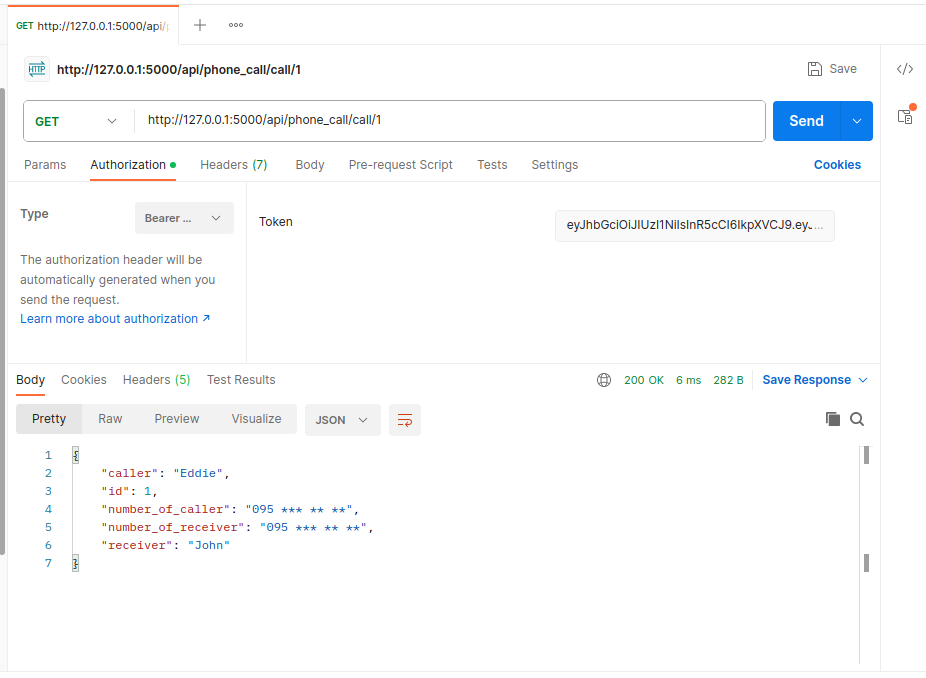

# Post call without auth:

# Post call with auth:

# Post call with empty column:

# Get all calls without auth:

# Get all calls with auth:

# Get call without auth:

# Get call with auth:

# Call not found:

# Put call without auth:

# Put call with auth:

# Delete call without auth:

# Delete call with auth:

